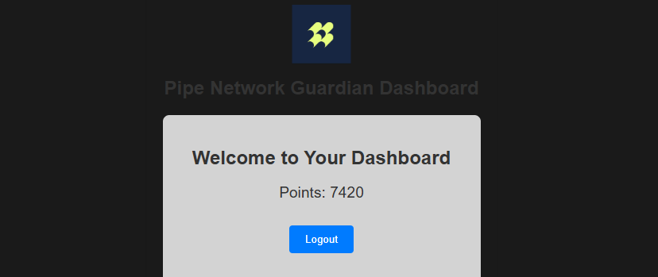

# Pipe Network 守护节点

Pipe Network | 重新定义数据交付的去中心化CDN 🌍 | 更快的带宽，更低的延迟 ⚡ | 基于 @Solana [https://pipecdn.app](https://pipecdn.app/signup?ref=bWVuZ2Nob2)

Pipe Network 通过两层节点系统将去中心化内容交付提升到新的水平，确保高性能和可靠性。PoP 节点和守护节点。🖥️📊

## 这里运行的是守护节点📊



## 守护节点 🛡️

守护节点位于 PoP 节点之上，充当看门狗的角色。它们持续监控网络健康状况，收集遥测数据，并优化路由以确保用户获得最快和最可靠的数据路径。

## 工作原理 🔍

守护节点从 PoP 节点收集实时指标，如延迟、带宽和正常运行时间。
通过这些洞察，它们可以动态地重新路由流量以避免瓶颈，从而提高整体网络性能。🚀

## 功能特性

- **注册新账户**
- **登录现有账户**
- **账户管理**
- **支持多账户**
- **支持代理和无代理运行**

## 环境要求

- **Node.js**: 确保已安装 Node.js。推荐版本：20+
- **依赖项**: 使用 `npm install` 安装必要的依赖项。

## 文件结构

- **account.json** 保存账户信息，如邮箱和密码
- **proxy.txt** 存储要使用的代理，每行一个代理 `http://用户名:密码@IP:端口`（可选）
- **token.json** 登录后保存访问令牌

## 安装步骤

### 首次安装

1. 克隆本仓库：
   ```bash
   git clone git@github.com:0xbaiwan/pipe_bot.git
   cd pipe_bot
   ```

2. 安装依赖：
   ```bash
   npm install
   ```

3. 配置账户：
   - 编辑accounts.json文件，添加您的账户信息
   - 如果需要使用代理，编辑proxy.txt文件

4. 运行脚本：
   ```bash
   npm run start
   ```
   
5. 按照终端中的说明完成设置：
   - 选择 1 注册新账户
   - 注册账户后需要选择登录以获取访问令牌
   - 选择 2 登录账户
   - 最后选择 3 运行机器人

### 更新代码

1. 拉取最新代码：
   ```bash
   git pull origin main
   ```

2. 如果遇到冲突：
   ```bash
   git stash
   git pull origin main
   git stash pop
   ```

## 无代理运行

程序现在支持无代理运行：
- 如果proxy.txt文件为空或不存在，程序将直接连接
- 如果有代理，则优先使用代理
- 日志会明确显示当前是使用代理还是直接连接

## 购买代理（可选）

- 免费静态住宅代理：
   - [WebShare](https://www.webshare.io/?referral_code=gtw7lwqqelgu)
   - [ProxyScrape](https://proxyscrape.com/)
   - [MonoSans](https://github.com/monosans/proxy-list)
- 付费高级静态住宅代理：
   - [922proxy](https://www.922proxy.com/register?inviter_code=d6416857)
   - [Proxy-Cheap](https://app.proxy-cheap.com/r/Pd6sqg)
   - [Infatica](https://dashboard.infatica.io/aff.php?aff=580)
